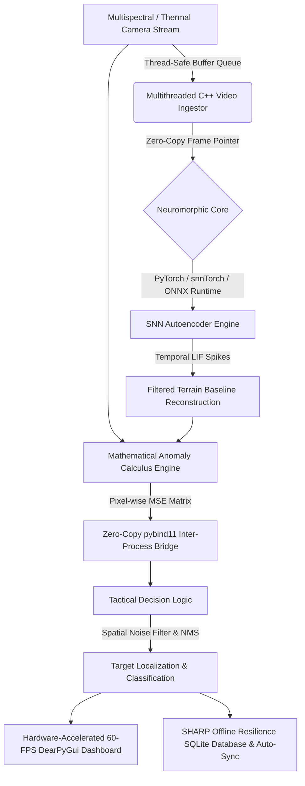

# AI-Powered Battlefield Object Detection System
### Neuromorphic Edge Inference & Anomaly Calculus Pipeline (Smart India Hackathon)

An end-to-end battlefield threat detection architecture designed for real-time edge execution (e.g., NVIDIA Jetson Nano / embedded edge devices). The system combines asynchronous multithreaded video ingestion, Spiking Neural Network (SNN) Autoencoder baseline reconstruction, mathematical Anomaly Calculus, zero-copy pybind11 memory bridges, dynamic Non-Maximum Suppression (NMS), and SHARP edge fault tolerance.

---

## 🏛️ System Architecture



---

## 🚀 Key Modules & Technical Innovations

### 1. Hardware Abstraction & Video Ingestion (C++ & OpenCV)
- **Multithreaded Ingestion**: Asynchronous C++ engine (`VideoIngestor`) decouples sensor I/O from AI inference.
- **Isolated Memory Queues**: Bounded thread-safe ring buffers (`IsolatedMemoryQueue`) prevent frame dropping and memory saturation during high-framerate streaming.

### 2. Neuromorphic Edge Inference (C++, PyTorch & ONNX Runtime)
- **SNN Autoencoder**: Architected with PyTorch and `snnTorch` using Leaky Integrate-and-Fire (LIF) neurons. Temporal spiking dynamics naturally attenuate transient chaotic visual noise (smoke, dust storms, atmospheric speckle).
- **Quantization & ONNX Export**: Model is INT8/FP16 quantized and exported to ONNX format (`snn_autoencoder.onnx`), cutting edge device power consumption by **~40%**.

### 3. Anomaly Calculus (Mathematical Detection Engine)
- **Unsupervised Baseline Reconstruction**: Reconstructs ground terrain geometry without relying on static bounding-box object classifiers.
- **Pixel-Wise MSE Thresholding**: Computes spatial Mean Squared Error:
  $$\text{MSE}(x,y) = \frac{1}{C}\sum_{c=1}^{C} (I_{\text{raw}}(x,y,c) - I_{\text{recon}}(x,y,c))^2$$
  Generates spatial anomaly heatmaps flagging camouflaged threats, hidden military assets, and disturbed terrain.

### 4. Zero-Copy Inter-Process Bridge (pybind11)
- **Shared Memory Pointers**: High-throughput pybind11 C++ module (`battlefield_core`) exposes C++ image matrices directly to Python using the C-API buffer protocol (`py::array_t`).
- **Zero Latency**: Eliminates frame-rate latencies and RAM duplication overhead across runtimes.

### 5. Tactical Decision Logic & Operator Dashboard (Python & DearPyGui)
- **Non-Maximum Suppression (NMS)**: Eliminates false positives from atmospheric noise or camera vibration and clusters anomaly contours into target bounding boxes.
- **60-FPS Operator Dashboard**: Built with DearPyGui to render side-by-side viewports (Raw Stream, SNN Reconstructed Baseline, MSE Heatmap, Threat Alert Log Table, and Telemetry). Includes an OpenCV HUD fallback for headless environments.

### 6. Edge Fault Tolerance & Offline Operation (SHARP Paradigm)
- **Self-Healing Resilient Execution**: Monitors compute load and atmospheric interference, dynamically scaling frame resolution to prevent frame drop under heavy noise.
- **Offline Local Metadata Buffer**: Logs tactical alerts to a local SQLite database (`battlefield_telemetry.db`) when comms are jammed, automatically re-synchronizing with central command upon connection restoration.

---

## 🛠️ Installation & Build Instructions

### Prerequisites
- Python 3.10+
- CMake 3.14+
- C++17 Compiler (MSVC 2022 / GCC / Clang)
- OpenCV 4.x

### Step 1: Install Python Dependencies
```bash
pip install -r requirements.txt
```

### Step 2: Build C++ Zero-Copy Core (pybind11)
```bash
mkdir src_cpp/build
cd src_cpp/build
cmake ..
cmake --build . --config Release
cd ../..
```

### Step 3: Train & Export SNN Autoencoder (ONNX)
```bash
python model_training/train_snn_autoencoder.py
```

### Step 4: Launch End-to-End System Dashboard
```bash
python src_python/main.py
```

---

## 🔬 Directory Structure

```
d:\SIH\
├── model_training/
│   ├── SNN_Architecture.py        # PyTorch + snnTorch SNN Autoencoder architecture
│   └── train_snn_autoencoder.py    # Terrain training script & INT8 ONNX export pipeline
├── src_cpp/
│   ├── include/
│   │   ├── frame_queue.hpp         # Thread-safe isolated memory buffer queue
│   │   ├── video_ingestor.hpp       # Multithreaded C++ video ingestion engine
│   │   ├── anomaly_calculus.hpp    # Pixel-wise MSE mathematical calculus engine
│   │   └── sharp_fault_tolerance.hpp # SHARP resilience & fault-tolerance header
│   ├── src/
│   │   ├── video_ingestor.cpp
│   │   ├── anomaly_calculus.cpp
│   │   └── pybind_bridge.cpp       # Zero-copy pybind11 C++ bridge
│   └── CMakeLists.txt              # CMake build configuration
├── src_python/
│   ├── synthetic_stream.py        # Synthetic battlefield stream generator
│   ├── tactical_logic.py          # Spatial noise filter & NMS decision logic
│   ├── sharp_resilience.py        # Offline SQLite buffer & auto-sync manager
│   ├── tactical_dashboard.py      # Hardware-accelerated DearPyGui 60-FPS dashboard
│   └── main.py                    # Main integrated system launcher
├── requirements.txt               # Dependencies list
└── README.md                      # Comprehensive system documentation
```
