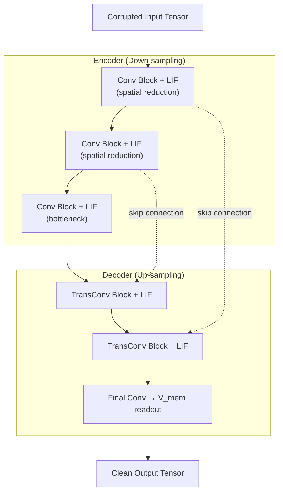
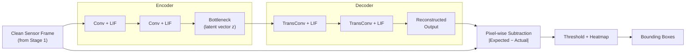
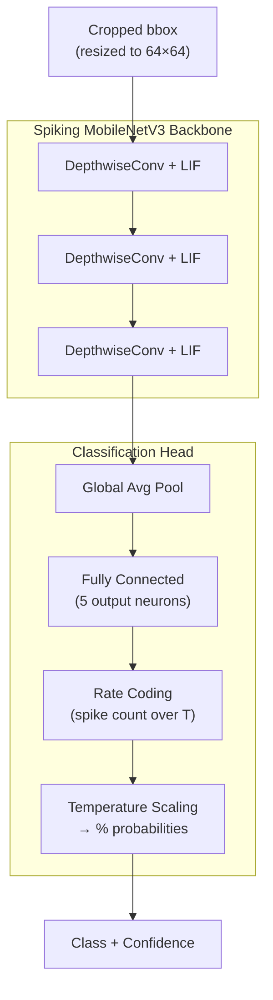
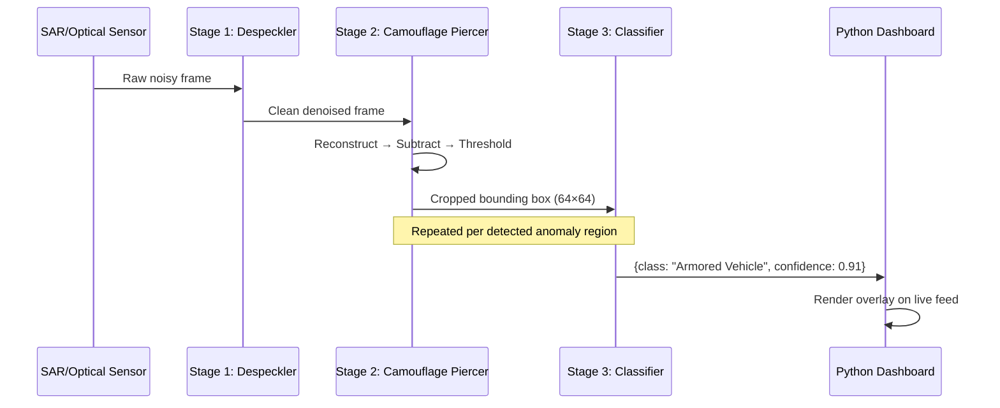

# Battlefield Detector — System Architecture

## High-Level Overview

The system is a **three-stage neuromorphic inference pipeline**. Each stage is an independent Spiking Neural Network (SNN) model that runs sequentially on edge hardware via the C++ ONNX Runtime. Raw sensor data enters Stage 1 and exits Stage 3 as classified threat labels with confidence scores.


> [!IMPORTANT]
> Every model uses **Leaky Integrate-and-Fire (LIF)** neurons and exports to **statically unrolled ONNX**. This means no dynamic loops at inference time — the temporal dimension is baked into the graph at export, making all three models compatible with standard C++ ONNX Runtime without neuromorphic-specific hardware.

---

## Stage 1 — Spiking Despeckler (SAR Noise Filter)

**Purpose:** Strip multiplicative speckle noise from raw sensor feeds while preserving hard structural edges.

### Architecture: Spiking U-Net (S-UNet)



### Key design decisions explained

| Decision | Rationale |
|---|---|
| **U-Net topology** | Skip connections let the decoder recover fine edge detail that the bottleneck compresses away. Critical for preserving target outlines. |
| **LIF neurons at every block** | Each neuron integrates input over T timesteps and leaks — this acts as a natural temporal low-pass filter, smoothing noise while retaining persistent (structural) signals. |
| **V_mem readout (not spike count)** | The final layer reads the raw membrane potential at timestep T, converting the spiking domain back into a continuous 2D pixel array. This avoids lossy binary quantization at the output. |
| **MSE + SSIM loss** | MSE alone would produce blurry outputs. SSIM penalizes structural distortion, forcing the network to keep edges sharp. |
| **Surrogate gradients (Sigmoid/ATan)** | LIF neurons fire binary spikes (non-differentiable). Surrogate gradient functions approximate the step function's derivative during backprop so standard gradient descent still works. |

### Training data flow

```
Clean image → Corruption Engine (Rayleigh + Gamma noise) → Corrupted image
Training pair: [Corrupted] → model → [Clean ground truth]
```

### Export deliverable
- `.onnx` model with T timesteps statically unrolled
- Validation script asserting PyTorch ↔ ONNX equivalence to `10⁻⁴` tolerance

---

## Stage 2 — Camouflage Piercer (Anomaly Autoencoder)

**Purpose:** Learn what "normal terrain" looks like, then flag anything that deviates from that baseline.

### Architecture: Spiking Autoencoder



### Key design decisions explained

| Decision | Rationale |
|---|---|
| **Train on negatives only (zero targets)** | The autoencoder learns to perfectly reconstruct empty terrain. When a target appears, reconstruction fails — the error *is* the detection signal. No labeled target data needed. |
| **Pixel-wise subtraction as anomaly metric** | Simple and interpretable: `|reconstructed − input|`. High-variance regions = something the model has never seen = potential target. |
| **Thresholded heatmap → bounding boxes** | Raw subtraction produces a continuous error map. Thresholding converts it to binary regions; connected-component analysis extracts bounding boxes. |
| **MSE loss on normal data only** | Forces the bottleneck to compress terrain features. Anything that doesn't compress well (targets, camouflaged objects) produces high reconstruction error. |
| **Spiking neurons as temporal filter** | For streaming video, LIF neurons naturally accumulate evidence over time — transient noise gets filtered, persistent anomalies get amplified. |

### Critical constraint

> [!CAUTION]
> The training set must contain **absolutely zero** tactical targets. Any target contamination teaches the autoencoder to reconstruct targets as "normal," directly sabotaging detection capability.

### Export deliverables
- `.onnx` model with statically unrolled temporal graph
- `calibration_data.npy` — 500-sample NumPy array of normal terrain tensors for INT8 quantization calibration by the C++ team

---

## Stage 3 — Target Classifier (Threat Identification)

**Purpose:** Take each bounding box from Stage 2 and classify it into one of 5 tactical categories.

### Architecture: Lightweight Spiking ConvNet (S-CNN)



### Output classes

| Index | Label |
|---|---|
| 0 | Infantry |
| 1 | Armored Vehicle |
| 2 | Tactical Truck |
| 3 | RF Signature |
| 4 | False Positive / Environmental Noise |

### Key design decisions explained

| Decision | Rationale |
|---|---|
| **MobileNetV3 adaptation** | Depthwise separable convolutions minimize parameter count — critical for edge deployment where memory and compute are constrained. |
| **64×64 fixed input** | Standardizes all bounding boxes to a tiny spatial footprint. Keeps memory usage predictable and low regardless of original bbox size. |
| **Rate coding readout** | Each output neuron fires spikes over T timesteps. The neuron with the highest total spike count wins the classification. More biologically plausible and noise-robust than single-shot softmax. |
| **Temperature scaling** | Converts raw spike rates into calibrated probability percentages. Without it, the model would be overconfident — temperature scaling compresses the distribution to produce honest confidence scores. |
| **Class 4 (False Positive)** | Explicitly models the case where Stage 2 flagged noise or environmental artifacts. Gives the pipeline a built-in rejection mechanism. |
| **Cross-Entropy loss** | Standard classification loss. Works with surrogate gradients through the spiking layers. |
| **Extreme augmentation** | Rotations, partial occlusion, low-light degradation simulate real aerial conditions — prevents the model from only working on clean, well-lit, perfectly-framed targets. |

### Export deliverables
- `.onnx` model with statically unrolled temporal graph
- `class_map.json` — maps `{0: "Infantry", 1: "Armored Vehicle", ...}` for the UI dashboard

---

## End-to-End Data Flow



---

## Shared Infrastructure

All three models share these common building blocks:

| Component | Implementation |
|---|---|
| **Neuron model** | Leaky Integrate-and-Fire (LIF) via `snnTorch` or `SpikingJelly` |
| **Backprop through spikes** | Surrogate gradient functions (Fast Sigmoid, ATan) |
| **Export format** | ONNX with statically unrolled temporal loops |
| **Edge runtime** | C++ ONNX Runtime |
| **Training framework** | PyTorch |

### Why static temporal unrolling matters

A spiking network simulates T discrete timesteps. Normally this is a loop:

```
for t in range(T):
    spikes = lif(input[t])
```

Static unrolling **flattens this loop into the computation graph** at export time. The ONNX file contains T copies of the layer logic chained sequentially. This eliminates:
- Dynamic control flow (no `if`/`for` in the graph)
- The need for neuromorphic-aware runtimes
- Any runtime overhead from loop evaluation

The tradeoff is a larger `.onnx` file (roughly T× the single-step graph), but inference speed and compatibility are guaranteed.

---

## Suggested Project Structure

```
battlefield-detector/
├── data/
│   ├── raw/                    # Source datasets (MSTAR, VisDrone, etc.)
│   ├── pairs/                  # Stage 1: corrupted ↔ clean pairs
│   ├── baselines/              # Stage 2: normal terrain only
│   └── targets/                # Stage 3: cropped target classes
├── models/
│   ├── despeckler/
│   │   ├── model.py            # S-UNet architecture
│   │   ├── train.py            # Training loop
│   │   ├── export.py           # PyTorch → ONNX export
│   │   └── validate.py         # PyTorch ↔ ONNX equivalence check
│   ├── piercer/
│   │   ├── model.py            # Spiking Autoencoder architecture
│   │   ├── train.py
│   │   ├── export.py
│   │   └── calibration.py      # Generate 500-sample .npy baseline
│   └── classifier/
│       ├── model.py            # Spiking MobileNetV3 architecture
│       ├── train.py
│       ├── export.py
│       └── class_map.json      # {0: "Infantry", ...}
├── pipeline/
│   ├── inference.py            # Chains all 3 stages end-to-end
│   └── dashboard.py            # Python UI rendering
├── exports/
│   ├── despeckler.onnx
│   ├── piercer.onnx
│   ├── classifier.onnx
│   └── calibration_data.npy
└── PRDs/
    ├── Spiking_Despeckler_PRD.md
    ├── Camouflage_Piercer_PRD.md
    └── Tagret_Classifier_PRD.md
```
